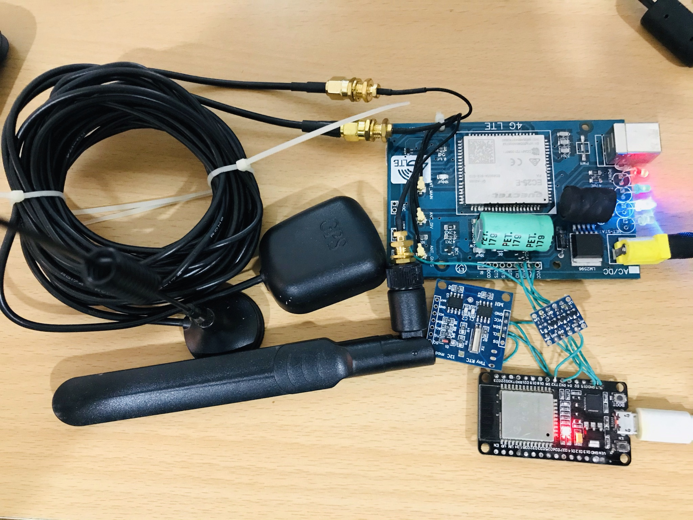

# ESP32_FOTA_via_EC25-module
FIRMWARE OVER THE AIR for ESP32 via EC25 4G module through AT Commands.

### DESCRIPTION
The main motive of this project is to make Firmware Upgrade for ESP32 from WEB :earth_asia:. The ESP32 has its own WiFi connectivity and FOTA can be upgraded from that. There are many examples available for WIFI_FOTA for ESP32. But in Our project the main motive is to download the firmware from http server via GSM :signal_strength: module with help of Simple AT Commands :fire:. 

### REQUIREMENTS
1. ESP32 Module (DEVKITV1 -- USED) :pager: .

2. QUECTEL EC25-E Module :signal_strength:.

3. LEVEL CONVERTER.

### PRE-INSTALLATION ON WINDOWS :computer:
*  Visual Studio Code with  platformIO Extension.


### PROCEDURE :newspaper:
1. Install the Visual Studio Code software and add platformIO Extension.
2. Install espressif32 platform in platformIO Extension.
3. Download the Project and open the project in platformIO Extension.
4. Then change the link of your own HTTP page in following function,
    ```c
    void  EC25_WEB_CONN()
    {
        ...
        EC25.println("http://***************nk1.bin");
        ...
    }
    ```
5. Flash the program in ESP32.

### PROJECT FILE DESCRIPTION
1. The Project contains following Files
```
main.c
default.CSV
platformio.ini
```
$ `main.c`   :clipboard:

* The source code with all the header file attached with it.
* There is two Serial communication enabled, one for EC25 and another for ESP32.


$ `default.CSV` :clipboard:

* This file contains complete Boot Partitions Details of the ESP32.

| Name   |   Type | SubType | Offset  |  Size    | Flags |
|--------|--------|---------|---------|----------|-------|
| nvs    | data   | nvs     | 0x9000  | 0x5000   |       |
| otadata| data   | ota     | 0xe000  | 0x2000   |       |
| app0   | app    | ota_0   | 0x10000 | 0x140000 |       |
| app1   | app    | ota_1   | 0x150000| 0x140000 |       |
| spiffs | data   | spiffs  | 0x290000| 0x170000 |       |

* The above details are on the file and it represents all the start address and size of each partition.

$ `platformio.ini` :clipboard:

* This file contains all setup.

```ini
[env:lolin32]

platform = espressif32

board = lolin32

framework = arduino

lib_extra_dirs = (your PATHNAME to library).

board_build.partitions =default.csv
```

## Caution :warning:
* This project files are only for Window OS.
* This is completely for a demo purposes and not yet Developed with Standard protocols :beginner:.
* In Future Code will be Standardize.

### IMAGES :camera:

